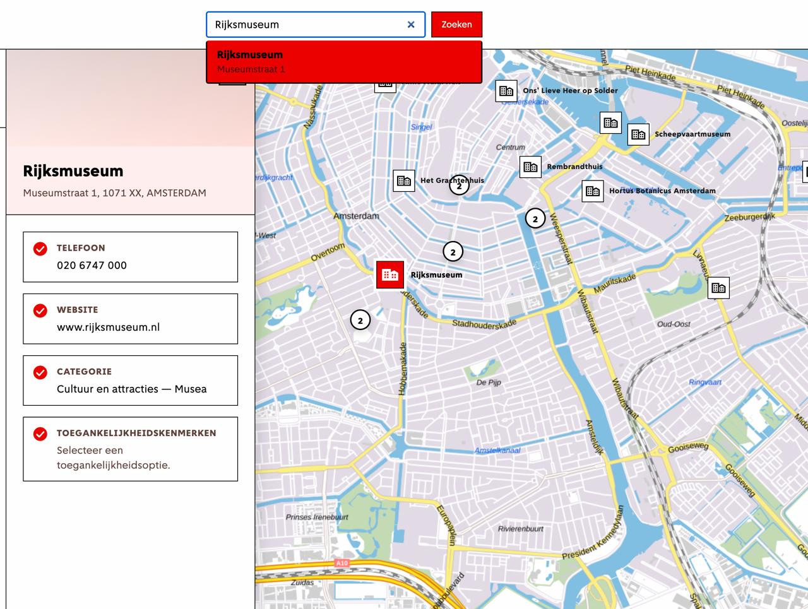
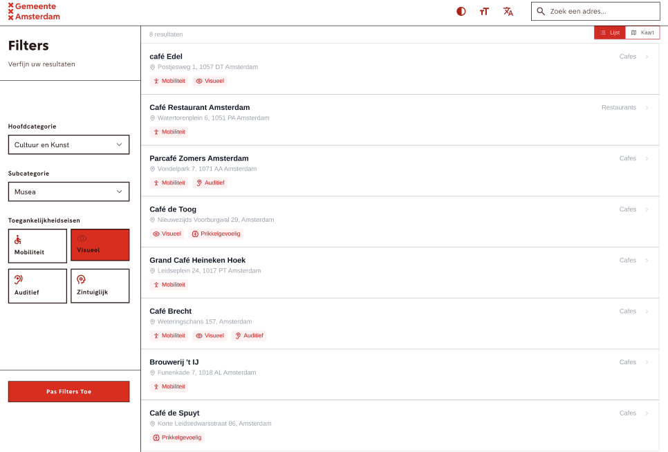
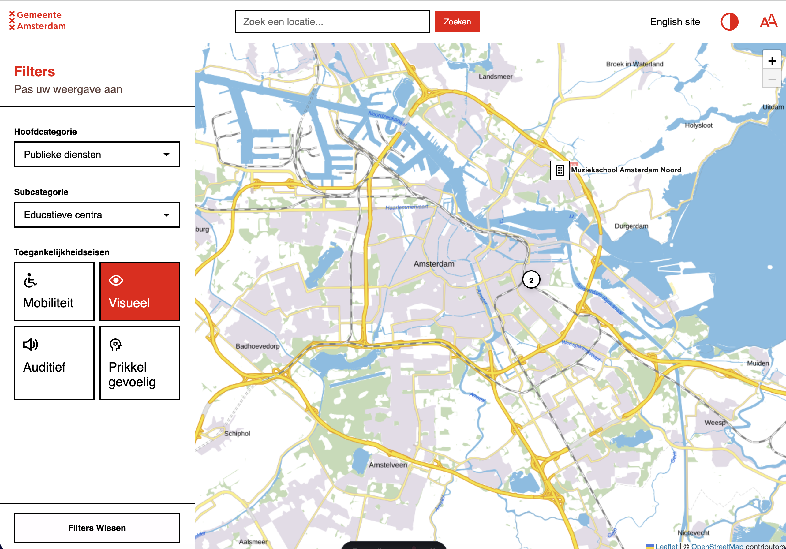

# Project Atlas(Gemeente Amsterdam)

## Voorwoord
De Gemeente Amsterdam wil de stad toegankelijker maken voor mensen met een lichamelijke beperking door bestaande data in te zetten voor een online kaartplatform.

## Debrief Gemeente Amsterdam Atlas

**De Kern (The Why)**
De Gemeente Amsterdam heeft bakken met data over de stad, maar deze data is momenteel onbruikbaar voor de burger die er daadwerkelijk baat bij heeft. Inwoners met een lichamelijke beperking missen een centraal, betrouwbaar startpunt om te controleren of een locatie of route voor hen begaanbaar is. Dit leidt tot onzekerheid en uitsluiting.

**De doelstelling**
Het bouwen van een online platform (Atlas) waarmee burgers met een fysieke beperking direct kunnen filteren en zoeken op de toegankelijkheid van locaties in Amsterdam.

**Succes-indicatoren:**
De interface voldoet aantoonbaar aan de WCAG 2.1 AA-richtlijnen (getest met screenreaders en keyboard-only navigatie).
Informatie is binnen 3 kliks vindbaar via een logische filter-cascade.
De teksten en foutmeldingen scoren 100% op B1-taalbereik.

## Project voortgang

### Week 1
In week 1 hebben we eerst gekeken hoe Astro werkt en welke projectstructuur het beste past bij ons kaartproject. We hebben een nieuw Astro-project aangemaakt en de mappen logisch ingedeeld, met aparte directories voor pagina’s, componenten, assets en API-logica. Daarna hebben we de eerste basislayout opgebouwd: een header, een kaartgedeelte en een sidebar, zodat de kaart en filters later gemakkelijk met elkaar kunnen communiceren. Tegelijk hebben we bepaald welke componenten we nodig hebben en hoe ze data gaan ontvangen en doorgeven, zodat we later een duidelijke scheiding houden tussen UI, datafetching en kaartlogica.

#### Concrete wijzigingen
- Opzet van de Astro-website en projectstructuur.
- Onderzoek gedaan naar de Amsterdam API, PDOK-locatieserver en Leaflet.
- Eerste componenten en layout voor kaart, sidebar en zoekveld gemaakt.

#### Conclusie: Gemeente Amsterdam bezoek 1
- Beter data intergreeren
- Beter de interactie in beeld brengen
- Als er tijd is kijken naar verschillende filter mogelijkheden.
- Experimentele dingen zijn mogelijk.
- (Misschien kijken naar de data/api verwerken later in het project)

### Week 2
In week 2 hebben we de eerste functionaliteit van de kaart gebouwd. We zijn begonnen met het koppelen van Leaflet aan onze data, zodat GeoJSON-locaties als markers op de kaart verschijnen. Vervolgens hebben we server-side fetch-logica opgezet zodat de app automatisch de juiste data kan ophalen en verwerken voordat die op de kaart wordt getoond. Daarna hebben we een dropdown en filters toegevoegd zodat gebruikers categorieën kunnen selecteren en de kaart alleen de relevante locaties laat zien. Tot slot hebben we map popovers toegevoegd: als je op een locatie klikt, verschijnt er een paneel met extra details, toegankelijkheidsinformatie en knoppen om te printen of te delen. We begrepen van niels dat we de amsterdam api toch niet gaan gebruiken en dat we alleen gaan werken met de cba_dataset. Dat willen we volgende week weghalen zodat we niet onnodige data tonen op de kaart.

#### Concrete wijzigingen 
- Leaflet-kaart geïntegreerd en GeoJSON-markers toegevoegd.
- Server-side fetch-logica voor data opgezet.
- Dropdown/filterfunctionaliteit ontwikkeld en getest.
- Map popovers toegevoegd voor locaties met details, toegankelijkheidskenmerken en acties voor printen/de delen.

#### Conclusie: Gemeente Amsterdam bezoek 2
- een bepaalde radius in de buurt om de dingen in te laden.
- dataset tonen
- vind een manier om die lastige informatie te kunnen filteren
- de 4 hoofd categorieen zijn goed. maar er moet nog iets extra’s komen om de filter beter te maken.
- ze willen ook op bioscoop, restaurant, dierentuin kunnen zoeken (nice to have)
- kijken of je bij de zoekfunctie een complexere resultaten UI kan maken, bijvoorbeeld plaatjes van het gebouw toevoegen.
- Local storage die onthoudt welke beperkingen je hebt

### Week 3
<table>
  <tr>
    <td>In week 3 zijn we stap voor stap verbeteringen gaan aanbrengen. Eerst hebben we de zoekfunctie gekoppeld aan de Algolia‑gestuurde JSON-data, zodat het hele zoekproces veel sneller en gebruiksvriendelijker werd. Dit is iets wat een must have was voor de gemeente Amsterdam, dus hebben we de zoekfunctie gekoppeld aan de kaart zodat je direct naar de marker wordt gebracht wanneer je een selectie maakt in de zoekbalk.</td>
    <td></td>
  </tr>
</table> 

Daarna hebben we de kaart interactiever gemaakt door markers niet alleen te laten klikken, maar ook visueel te markeren met tooltips en een slimme controle op overlap zodat popovers en labels elkaar niet meer blokkeren. Tegelijk hebben we de sidebar, het zoekveld en de kaart met elkaar laten praten via CustomEvents, waardoor een gekozen locatie of filteractie netjes door het hele systeem gestuurd wordt. Voor de inhoud van de kaart lagen hebben we de dropdown-categorieën dynamisch verbonden met de API-data, zodat alleen de juiste categorieën en subcategorieën geladen worden. Ook hebben we extra informatie in de markertooltips gezet (zoals het aantal ja, nee en onbekend) en een legenda gemaakt.
Tot slot hebben we voor de de kaart een list view gemaakt voor de kaart omdat een kaart niet toegankelijk is voor screenreader gebruikers.

<table>
  <tr>
    <td></td>
    <td></td>
  </tr>
</table> 

#### Concrete wijzigingen
- Zoekfunctionaliteit laten zoeken in de json bestand met angolia
- Markeractivering, tooltip-styling en clustering verbeterd zodat labels en popovers netter op de kaart verschijnen.
- Communicatie tussen sidebar, zoekveld en kaart afgerond met CustomEvents voor geselecteerde locaties en filter-acties.
- Filters/subfilters dynamisch gekoppeld aan CBA API-data en kaartlagen per categorie beheerd.
- Tooltips toegevoegd om de aantal ja, nee en onbekent te tonen bij de markers.
- legenda gemaakt voor de tooltip
- Toegankelijkheid verbeterd met ARIA-attributen, focusvriendelijke elementen en een toegankelijkheidsknop in de sidebar.
- List view 

#### Conclusie: Gemeente Amsterdam bezoek 3
- meer verschil in de toegankelijkheid zien wat wat is. nu teveel text
- misschien categorieeen tog gescheiden houden en eventueel dubbele toegankelijkheids opties kunnen eventueel een eigen vak krijgen.
- misschien alles wat er is in een vak alles wat er niet is in een vak en alles wat onbekend is.
- er moet iets van een soort feedback krijgen van wat er gesellecteerd is wanneer je de toegankelijkheid knoppen gebruikt
- iconen set van iamamsterdam, toegankelijkheids toolkit.
- testplan kan gemaakt worden en zoeken naar een aantal test personen
- lijst met toegankelheid en basis informatie wat beter stylen
1. kleurtjes met scoren hoe toegankelijk een gebouw is?
2. hoe zwaar weegt een bepaalde toegankelijkheids punt en de score daar op baseren?
- bij de locatie iconen iets van een indicatie wat laat zien hoeveel ja, nee en onbekend values die locatie het heeft.

### Week 4
- L

# Bron
**pdok**
 https://api.pdok.nl/

 **amsterdam api**
 https://api.data.amsterdam.nl/v1/docs/datasets/bag.html

 - Astro Docs - Endpoints / API Routes  
  Gebruikt voor het maken van de server-side API-route in `src/pages/api/restaurants.js`.  
  https://docs.astro.build/en/guides/endpoints/

- Gemeente Amsterdam Datapunt API - Horeca  
  Gebruikt voor het ophalen van horeca-/restaurantdata uit de Amsterdam API.  
  https://api.data.amsterdam.nl/v1/docs/datasets/horeca.html

- Leaflet Documentation - GeoJSON  
  Gebruikt voor het tonen van GeoJSON-data als markers op de kaart met `L.geoJSON()`.  
  https://leafletjs.com/reference#geojson

- Leaflet Documentation - Map `removeLayer()`  
  Gebruikt om de restaurantlaag weer van de kaart te verwijderen wanneer een andere filter wordt gekozen.  
  https://leafletjs.com/reference#map-removelayer

- MDN Web Docs - `CustomEvent`  
  Gebruikt om communicatie tussen de sidebar en de kaartcomponent mogelijk te maken.  
  https://developer.mozilla.org/en-US/docs/Web/API/CustomEvent
  https://developer.mozilla.org/en-US/docs/Web/API/CustomEvent/CustomEvent

- MDN Web Docs - `dispatchEvent()`  
  Gebruikt voor het versturen van custom events zoals `filter:restaurants`.  
  https://developer.mozilla.org/en-US/docs/Web/API/EventTarget/dispatchEvent

# AI Bronnen
Ik werk aan een Astro/Leaflet kaart met data uit de Amsterdam API. Sommige schoolgebouwen hebben geen bruikbare GeoJSON Point-coördinaten. Ik wil daarom met de PDOK Locatieserver zoeken op adres, huisnummer en postcode. De PDOK response geeft een veld `centroide_ll` terug als tekst in de vorm `POINT(lon lat)`. Hoe kan ik deze string met JavaScript omzetten naar een GeoJSON Point object met numerieke coordinates? Leg vooral uit waarom `.replace('POINT(', '').replace(')', '').split(' ')` wordt gebruikt.