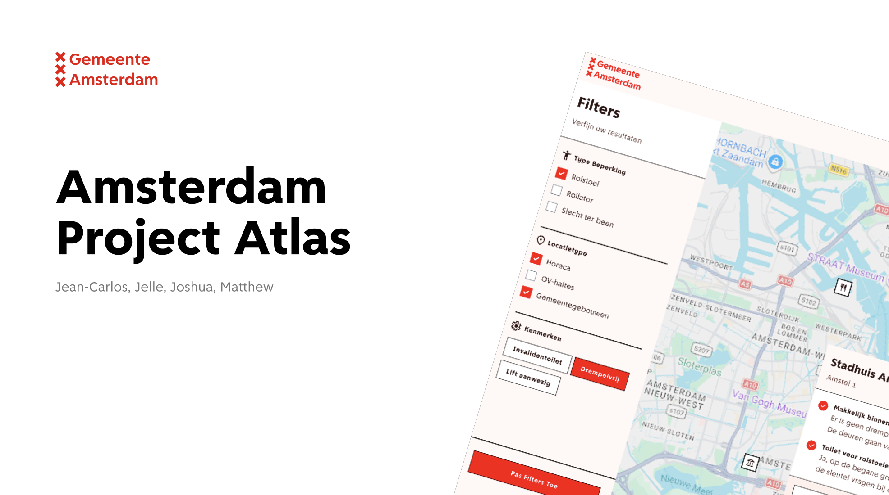

# Project Atlas(Gemeente Amsterdam)


## Voorwoord
De Gemeente Amsterdam wil de stad toegankelijker maken voor mensen met een lichamelijke beperking door bestaande data in te zetten voor een online kaartplatform.

## Debrief Gemeente Amsterdam Atlas

**De Kern (The Why)**
De Gemeente Amsterdam heeft bakken met data over de stad, maar deze data is momenteel onbruikbaar voor de burger die er daadwerkelijk baat bij heeft. Inwoners met een lichamelijke beperking missen een centraal, betrouwbaar startpunt om te controleren of een locatie of route voor hen begaanbaar is. Dit leidt tot onzekerheid en uitsluiting.

**De doelstelling**
Het bouwen van een online platform (Atlas) waarmee burgers met een fysieke beperking direct kunnen filteren en zoeken op de toegankelijkheid van locaties in Amsterdam.

**Succes-indicatoren:**
De interface voldoet aantoonbaar aan de WCAG 2.1 AA-richtlijnen (getest met screenreaders en keyboard-only navigatie).
Informatie is binnen 3 kliks vindbaar via een logische filter-cascade.
De teksten en foutmeldingen scoren 100% op B1-taalbereik.


# Bron
**pdok**
 https://api.pdok.nl/

 **amsterdam api**
 https://api.data.amsterdam.nl/v1/docs/datasets/bag.html

 - Astro Docs - Endpoints / API Routes  
  Gebruikt voor het maken van de server-side API-route in `src/pages/api/restaurants.js`.  
  https://docs.astro.build/en/guides/endpoints/

- Gemeente Amsterdam Datapunt API - Horeca  
  Gebruikt voor het ophalen van horeca-/restaurantdata uit de Amsterdam API.  
  https://api.data.amsterdam.nl/v1/docs/datasets/horeca.html

- Leaflet Documentation - GeoJSON  
  Gebruikt voor het tonen van GeoJSON-data als markers op de kaart met `L.geoJSON()`.  
  https://leafletjs.com/reference#geojson

- Leaflet Documentation - Map `removeLayer()`  
  Gebruikt om de restaurantlaag weer van de kaart te verwijderen wanneer een andere filter wordt gekozen.  
  https://leafletjs.com/reference#map-removelayer

- MDN Web Docs - `CustomEvent`  
  Gebruikt om communicatie tussen de sidebar en de kaartcomponent mogelijk te maken.  
  https://developer.mozilla.org/en-US/docs/Web/API/CustomEvent
  https://developer.mozilla.org/en-US/docs/Web/API/CustomEvent/CustomEvent

- MDN Web Docs - `dispatchEvent()`  
  Gebruikt voor het versturen van custom events zoals `filter:restaurants`.  
  https://developer.mozilla.org/en-US/docs/Web/API/EventTarget/dispatchEvent

- `includes()` gebruikt om te controleren of een waarde al in een array staat:  
  https://developer.mozilla.org/en-US/docs/Web/JavaScript/Reference/Global_Objects/Array/includes

- `push()` gebruikt om een nieuwe waarde aan het einde van een array toe te voegen:  
  https://developer.mozilla.org/en-US/docs/Web/JavaScript/Reference/Global_Objects/Array/push


# AI Bronnen
- **Antigravity (2026)**
  - **APA-bronvermelding**: Antigravity. (2026). *Antigravity AI Coding Assistant* [Large language model].
  - **Gebruik**: Geassisteerd bij het ontwerpen van de cross-browser oplossing voor het dynamisch filteren van subcategorieën in de dropdown-filters (`src/components/layout/SideBar.astro`). Door opties in JavaScript in het geheugen te houden en fysiek uit de DOM te verwijderen/toe te voegen, wordt voorkomen dat browsers zoals Safari de CSS-regel `display: none` op `<option>`-elementen negeren.

- **PDOK Coördinatenconversie**:
  Ik werk aan een Astro/Leaflet kaart met data uit de Amsterdam API. Sommige schoolgebouwen hebben geen bruikbare GeoJSON Point-coördinaten. Ik wil daarom met de PDOK Locatieserver zoeken op adres, huisnummer en postcode. De PDOK response geeft een veld `centroide_ll` terug als tekst in de vorm `POINT(lon lat)`. Hoe kan ik deze string met JavaScript omzetten naar een GeoJSON Point object met numerieke coordinates? Leg vooral uit waarom `.replace('POINT(', '').replace(')', '').split(' ')` wordt gebruikt.
Ik werk aan een Astro/Leaflet kaart met data uit de Amsterdam API. Sommige schoolgebouwen hebben geen bruikbare GeoJSON Point-coördinaten. Ik wil daarom met de PDOK Locatieserver zoeken op adres, huisnummer en postcode. De PDOK response geeft een veld `centroide_ll` terug als tekst in de vorm `POINT(lon lat)`. Hoe kan ik deze string met JavaScript omzetten naar een GeoJSON Point object met numerieke coordinates? Leg vooral uit waarom `.replace('POINT(', '').replace(')', '').split(' ')` wordt gebruikt.


# Code examples

**Hoe custom events werken**
De sidebar verstuurt een event als een filter wordt gekozen:
```js
window.dispatchEvent(new CustomEvent("filter:show", {
  detail: { name: "Musea" }
}));

De kaart luistert vervolgens naar dat event en toont de juiste laag:

window.addEventListener("filter:show", (event) => {
  const filterNaam = event.detail.name;
  layerManager.show(filterNaam);
});

```

**Hoe Algolia werkt**

Je stuurt je locaties naar Algolia. Algolia slaat die op in een index.

``` javascript 
await client.replaceAllObjects({
    indexName: 'locations',
    objects: alleLocaties  // jouw array met locaties
});

```

In deze app wordt Algolia gebruikt voor het zoekveld in `src/components/map/Search.astro`. Dat bestand haalt twee environment-variabelen op:

- `PUBLIC_ALGOLIA_APP_ID`
- `PUBLIC_ALGOLIA_SEARCH_KEY`

Met die waarden bouwt de code een Algolia-URL voor de index `locations` en stuurt een POST-verzoek met het zoekwoord.

Dit gebeurt in deze manier:

1. De gebruiker typt iets in het zoekveld.
2. De code wacht 200ms, zodat er niet direct bij elke letter een verzoek wordt verstuurd.
3. Er wordt een zoekopdracht naar Algolia gestuurd met `query: zoekwoord` en `hitsPerPage: 8`.
4. Algolia geeft `data.hits` terug: de gevonden locaties.
5. Die resultaten worden in een dropdown getoond.

Dus Algolia werkt als een zoekmachine.
